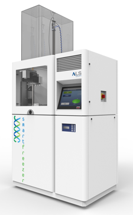

Title: One Way to Monitor Your Biobank
Date: 2014-03-28 11:40
Tags: biobanking
Category: biobanking
Slug: one_way_to_monitor_your_biobank
Author: Hinrich B. Winther

I just began my work at the University Medical Centre Mainz. One of the tasks of my workgroup is to establish a kryo-biobank. For this a SmartFreezer® 2.0 from [Angelantoni Industrie] has been aquired.

There are many things you have to tackle in order to setup a biobank. One of the more important ones is quality management. In order to produce reliable test results you need to know how in which conditions the specimen, resp. the vial, has been stored.

Temperature Monitoring
----------------------

The most important kriteria you should monitor is the temperature of your vials. For this 

[Angelantoni Industrie]: http://www.angelantoni.it

